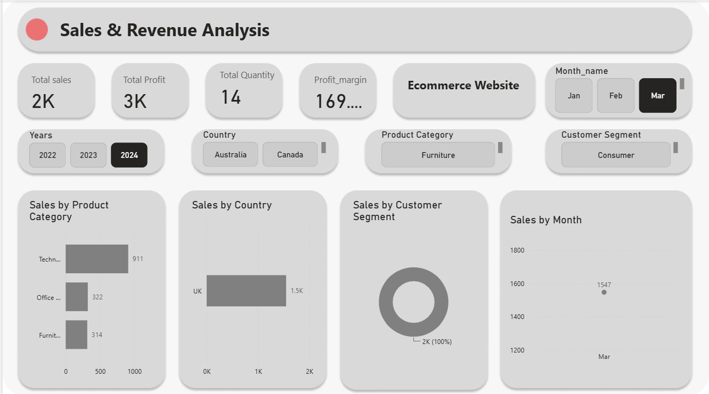
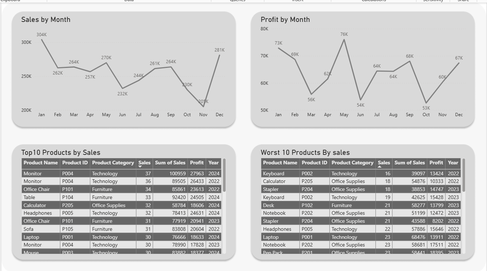

# 📊 Sales & Revenue Analysis Dashboard

A professional **Power BI Dashboard** built to analyze sales performance, revenue trends, customer behavior, and business profitability. This interactive dashboard helps businesses monitor KPIs, identify growth opportunities, and make data-driven decisions using dynamic filters and visualizations.

---

# 📸 Dashboard Preview

Below is a preview of the interactive **Sales & Revenue Analysis Dashboard** built in Microsoft Power BI.

<p align="center">
  
</p>

<p align="center">
  
</p>

---

## 🌐 Live Dashboard

Explore the interactive Power BI dashboard online.

<p align="center">
  <a href="https://app.powerbi.com/groups/me/reports/baa6f87a-4f2b-45a0-a2ba-e0cfd28c7e70/94fc5ae87b00acaa951e?experience=power-bi">
    
  </a>
</p>

---

# 🚀 Project Overview

The Sales & Revenue Analysis Dashboard provides a complete overview of business performance through interactive visualizations. It enables users to analyze sales across different countries, product categories, customer segments, and time periods while tracking key business metrics such as revenue, profit, quantity sold, and profit margin.

The dashboard is designed for:

- Business Analysts
- Sales Managers
- Marketing Teams
- Executives
- Decision Makers

---

# 🎯 Business Problem

Businesses often collect large volumes of sales data but struggle to convert it into actionable insights.

This dashboard solves that problem by providing:

- Real-time KPI monitoring
- Sales trend analysis
- Country-wise performance comparison
- Product category insights
- Customer segmentation analysis
- Interactive filtering for quick decision making

---

# 📈 Dashboard Features

## KPI Cards

The dashboard displays key business metrics:

- 💰 Total Sales
- 📈 Total Profit
- 📦 Total Quantity Sold
- 📊 Profit Margin

These KPIs update dynamically based on selected filters.

---

## Interactive Filters (Slicers)

Users can filter the dashboard using:

- Year
- Month
- Country
- Product Category
- Customer Segment

All visuals update instantly after applying filters.

---

## Visualizations

### 1. Sales by Product Category

Horizontal Bar Chart

Purpose:

- Compare revenue generated by different product categories.
- Identify the best-performing products.

Example:

- Technology
- Office Supplies
- Furniture

---

### 2. Sales by Country

Horizontal Bar Chart

Purpose:

- Analyze country-wise sales performance.
- Compare international markets.

Useful for:

- Regional sales analysis
- Market expansion decisions

---

### 3. Sales by Customer Segment

Donut Chart

Purpose:

Visualizes contribution from customer segments such as:

- Consumer
- Corporate
- Home Office

Helps understand customer distribution.

---

### 4. Geographic Map

Displays sales distribution geographically.

> Note:
If the map does not appear, enable **Map and Filled Map Visuals** in Power BI Admin Portal.

---

# 📊 KPIs Included

| KPI | Description |
|------|-------------|
| Total Sales | Total revenue generated |
| Total Profit | Overall business profit |
| Total Quantity | Number of products sold |
| Profit Margin | Profit percentage over sales |

---

# 🛠 Tools & Technologies

- Microsoft Power BI
- Power Query
- DAX (Data Analysis Expressions)
- Data Modeling
- Excel Dataset
- Interactive Visualizations

---

# 📂 Dataset

The dashboard is built using a sales dataset containing information such as:

- Order Date
- Customer
- Country
- Region
- Product Category
- Product Name
- Quantity
- Sales
- Profit
- Discount
- Customer Segment

---

# 🧮 DAX Measures Used

Example measures used in this project:

## Total Sales

```DAX
Total Sales =
SUM(Sales[Sales])
```

---

## Total Profit

```DAX
Total Profit =
SUM(Sales[Profit])
```

---

## Total Quantity

```DAX
Total Quantity =
SUM(Sales[Quantity])
```

---

## Profit Margin

```DAX
Profit Margin =
DIVIDE([Total Profit],[Total Sales],0)
```

---

# 📊 Data Cleaning Process

The dataset was cleaned using Power Query.

Cleaning steps included:

- Removed null values
- Removed duplicate records
- Corrected data types
- Renamed columns
- Standardized date format
- Checked missing values
- Created calculated columns

---

# 📈 Insights Generated

The dashboard provides insights such as:

- Top-performing product categories
- Country-wise sales distribution
- Customer segment contribution
- Profitability trends
- Revenue comparison across months
- Overall business performance

---

# 💡 Business Value

This dashboard helps organizations:

- Track KPIs in real time
- Improve sales strategy
- Monitor profitability
- Identify high-performing markets
- Understand customer behavior
- Support executive decision making

---

# 📁 Project Structure

```
Sales-Revenue-Dashboard/
│
├── Dashboard.pbix
├── Dataset.xlsx
├── README.md
├── assets/
│   └── dashboard.png
└── screenshots/
    ├── Home.png
    ├── Filters.png
    └── Insights.png
```

---

# ▶️ How to Use

1. Clone this repository

```bash
git clone https://github.com/yourusername/Sales-Revenue-Dashboard.git
```

2. Open the `.pbix` file in Microsoft Power BI Desktop.

3. Refresh the dataset if needed.

4. Explore the dashboard using the interactive slicers.

---

# 📌 Dashboard Highlights

✅ Interactive Dashboard

✅ Dynamic KPI Cards

✅ DAX Measures

✅ Power Query Data Cleaning

✅ Responsive Visualizations

✅ Business Insights

✅ Executive Reporting

---

# 📷 Dashboard Components

- KPI Cards
- Product Category Analysis
- Country-wise Sales Analysis
- Customer Segment Analysis
- Geographic Sales Map
- Dynamic Filters
- Executive Summary

---

# 🔮 Future Improvements

- Forecasting using Power BI Analytics
- Monthly trend analysis
- Top 10 customers report
- Sales target vs actual
- Drill-through pages
- Tooltip pages
- Time intelligence calculations
- YoY Growth
- MoM Growth
- Profit Trend Analysis

---

# 🎓 Skills Demonstrated

- Power BI
- DAX
- Power Query
- Data Cleaning
- Data Modeling
- Dashboard Design
- Data Visualization
- Business Intelligence
- KPI Reporting
- Sales Analytics

---

# 📬 Contact

**Vaibhav Chauhan**

📧 Email: your-email@example.com

💼 LinkedIn: https://linkedin.com/in/vaibhavchauhan15

💻 GitHub: https://github.com/vaibhavchauhan-15

---

## ⭐ If you found this project useful, don't forget to star the repository!
